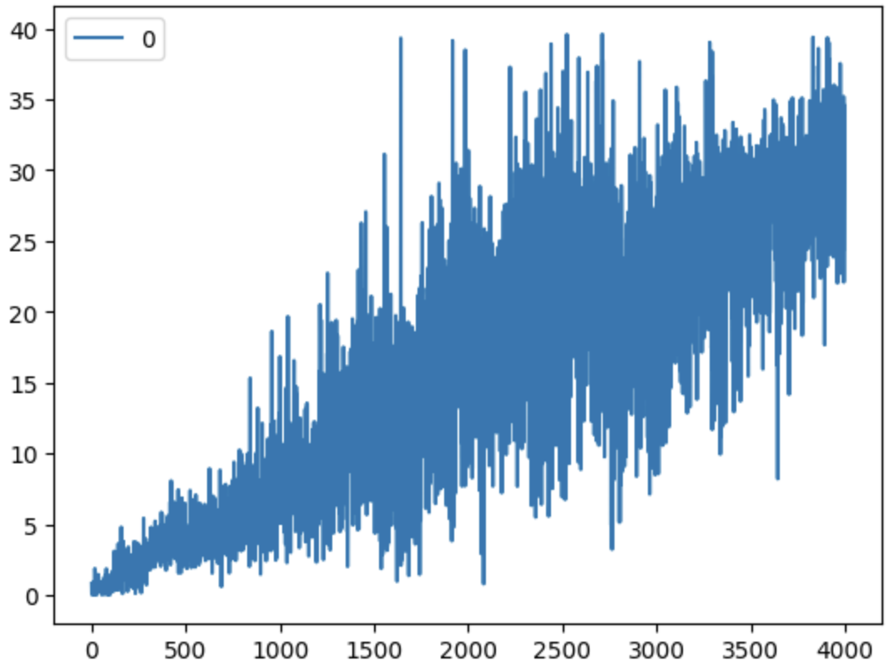
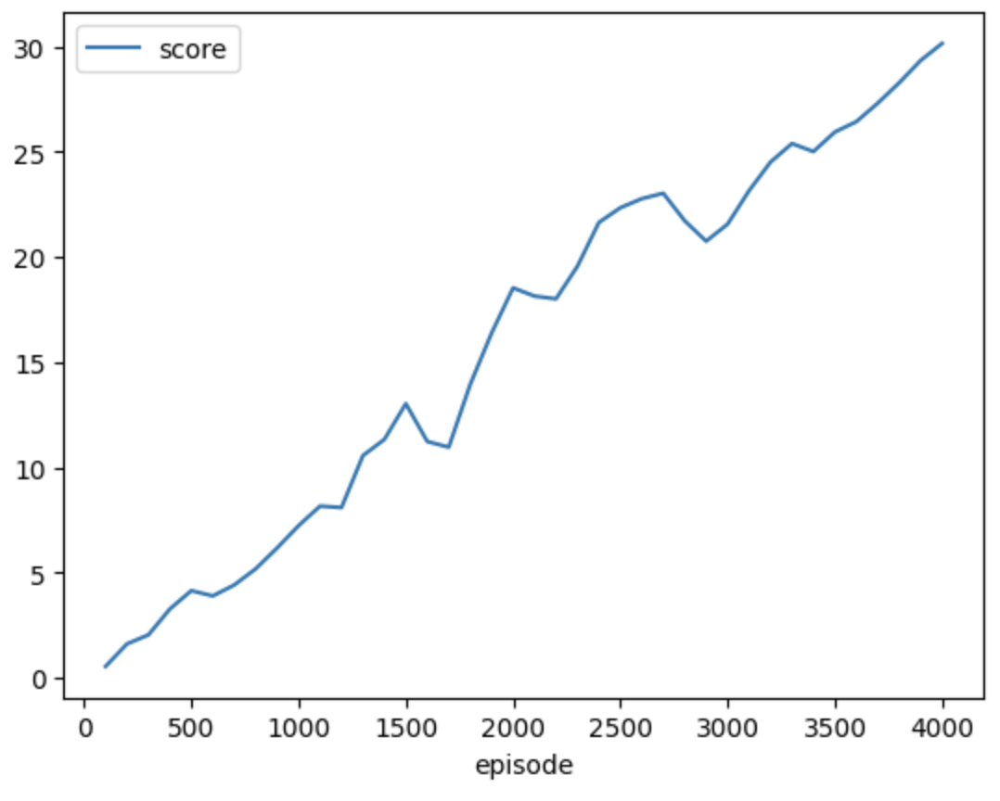

[//]: # (Image References)

[scores_100]: ./images/training_avg_every_100_episodes.png "100 Episode Average Scores"
[scores_all]: ./images/training_1_4000.png "All Scores"

# Report

This report details the algorithm used to solve the Udacity nano-degree Unity Reacher environment with relevant performance metrics and ideas for future work.

## Learning Algorithm

The learning algorthm used to solve this environment was a Deep Deterministic Policy Gradient (DDPG) with experience replay with local target policy and value networks and soft updates to the target network every 10 steps.  Updating the target network every 10 steps allows us to decouple the local network training from the target network training and in provides better stability in training.  Without this decoupling, the agent failed to train.

## Model Architecture

The agent itself used two a fully connected deep neural nets defined in [ddpg_model.py](./ddpg_model.py) whose networks for the actor and critic were defined as shown below.  We used a relatively high hidden latent space (with respect to the number of degrees of freedom in the observation space) to allow the algorithm to learn complex relationships as the non-linear trigonometric relationships which tie the states together in the robotic arm would need significant numbers of DOF's to be able to accurately represent the motions needed.  While the agent was able to solve the environment, a smaller number of hidden units could likely have solved the environment as well and this optimization was left to a future exercise. The hidden layers used a ReLU activation functions and the final output layer which mapped to the four available continuous action dimensions did not have any additional shaping functions applied.  The number of nodes in each layer of this network are as follows:

The actor network is a straight deep neural network mapping the observation space to the action space while the critic network injects the actions selected into the second layer of the network, concatinated with the output of the first network to ensure that the critic network combines both the states and actions being taken in the assignment of the value of any given state-action pair a given point in time.


```
Actor(
  (fc1): Linear(in_features=33, out_features=400, bias=True)
  (fc2): Linear(in_features=400, out_features=300, bias=True)
  (fc3): Linear(in_features=300, out_features=4, bias=True)
)
```

```
# Note that the fc2 layer of the critic has 404 input features since 
# the 4 action features are inserted into the critic in this second layer.
Critic(
  (fcs1): Linear(in_features=33, out_features=400, bias=True)
  (fc2): Linear(in_features=404, out_features=300, bias=True)
  (fc3): Linear(in_features=300, out_features=1, bias=True)
)
```

## Hyperparameters

For training, the agent used the following hyper parameters:

```
BUFFER_SIZE = int(1e6)  # replay buffer size
BATCH_SIZE = 128        # minibatch size
GAMMA = 0.99            # discount factor
TAU = 1e-3              # for soft update of target parameters
LR_ACTOR = 1e-4         # learning rate of the actor 
LR_CRITIC = 1e-3        # learning rate of the critic
WEIGHT_DECAY = 0        # L2 weight decay
UPDATE_EVERY = 10       # update the target network every X steps
```

The `UPDATE_EVERY` parameter was used to update the networks every 10 timesteps in order to decouple the local and target network training and ensure stability.  Without this decoupling, the network failed to train.  

The `BATCH_SIZE` of 128 was the default batch size which seemed to work on the CPU on a local machine.  A `BATCH_SIZE` of 1024 was also used on the Udacity GPU instance to improve stability of training and enabled faster gains in training; however, Udacity system timeouts and errors with restarting had a severe negative impact on productivity of training and progress of the project.  With the issues encountered attempting to use the Udacity environment, these larger batch sizes were abandoned for smaller batch sizes trained on a CPU locally.  This is not to say that GPU's would not be useful for training, indeed they are likely useful if the practitioner is provided with a GPU in a stable working environment which did not exist with the Udacity provided environments.

## Training

After running into significant challenges training as noted in the appendix below, by using a single agent on a CPU and updating the actor and critic networks a single time every 10 time steps, the agent was able to learn and solve the environment.  The training was slow; however, the environment indeed was solved.

Increasing the batch size resulted in slower training and did not seem to help the wall time to train on the CPU.  

I attempted to perform parallel training of multiple agents; however, generation of the data was slow and the overall time to generate data and learn increased.  This is curious as it seems that the Unity environment should be able to leverage multiple cores when using multiple agents; however, the provided simulation environment did not appear to use multi-core processing with either the linux or Mac versions of the training environment.  Revisiting a model using multiple agents acting in parallel and populating a shared memory buffer will be left to a future exercise and evaluation.

The agent solved the environment on the 4000th episode.  Note that this is quite a few more episodes than were used to solve the benchmark environment with 20 parallel agents, but since this is a single agent training, it is expected to require more episodes to gain similar experience to achieve similar performance.  Taking this into account, this agent saw as much data in 4000 episodes as an agent would see in 200 episodes if it were training on 20 parallel environments like the benchmark solution.

Checkpoints for each training iteration are found in the [checkpoints](./checkpoints) directory.

## Agent Performance & Plot of Rewards

Performance of the agent in the environment at varied checkpoints are shown below.  

Examples of how various checkpoints of the agent performs after different checkpoints are found in the [videos](./videos) directory.  Note that the agent has learned how to track the ball; however, the agent does not track the ball perfectly.  Note that as the agent reached the target score of 30 over 100 episodes, that the agent was still learning, so with additional training, the agent is expected to continue to improve.

The videos are also provided on YouTube for easy reference:
* [Example 1](https://youtu.be/LYEnDkjd5Jw)
* [Example 2](https://youtu.be/0oCo_JZMIlM)
* [Example 3](https://youtu.be/-mGYejZ4HTQ)
* [Example 4](https://youtu.be/To14LFtlG4Y)

Training of all episodes from 1 to 4000:



Average scores every 100 episodes:



Log of training progress:
```
# Episode 100	Average Score: 0.54 	 Memory Size: 100000	Elapsed Time: 326.43 sec
# Episode 200	Average Score: 1.61 	 Memory Size: 200000	Elapsed Time: 654.41 sec
# Episode 300	Average Score: 2.04 	 Memory Size: 300000	Elapsed Time: 991.05 sec
# Episode 400	Average Score: 3.27 	 Memory Size: 400000	Elapsed Time: 1362.51 sec
# Episode 500	Average Score: 4.14 	 Memory Size: 500000	Elapsed Time: 1754.18 sec
# Episode 600	Average Score: 3.89 	 Memory Size: 600000	Elapsed Time: 2152.66 sec
# Episode 700	Average Score: 4.41 	 Memory Size: 700000	Elapsed Time: 2559.37 sec
# Episode 800	Average Score: 5.18 	 Memory Size: 800000	Elapsed Time: 2973.95 sec
# Episode 900	Average Score: 6.17 	 Memory Size: 900000	Elapsed Time: 3399.83 sec
# Episode 1000	Average Score: 7.23 	 Memory Size: 1000000	Elapsed Time: 3845.35 sec
# Episode 1100	Average Score: 8.16 	 Memory Size: 1000000	Elapsed Time: 4328.45 sec
# Episode 1200	Average Score: 8.09 	 Memory Size: 1000000	Elapsed Time: 4788.11 sec
# Episode 1300	Average Score: 10.56	 Memory Size: 1000000	Elapsed Time: 5247.74 sec
# Episode 1400	Average Score: 11.33	 Memory Size: 1000000	Elapsed Time: 5709.66 sec
# Episode 1500	Average Score: 13.03	 Memory Size: 1000000	Elapsed Time: 6177.41 sec
# Episode 1600	Average Score: 11.23	 Memory Size: 1000000	Elapsed Time: 6644.36 sec
# Episode 1700	Average Score: 10.96	 Memory Size: 1000000	Elapsed Time: 7104.40 sec
# Episode 1800	Average Score: 13.94	 Memory Size: 1000000	Elapsed Time: 7565.07 sec
# Episode 1900	Average Score: 16.39	 Memory Size: 1000000	Elapsed Time: 8022.08 sec
# Episode 2000	Average Score: 18.53	 Memory Size: 1000000	Elapsed Time: 8480.95 sec
# Episode 2100	Average Score: 18.14	 Memory Size: 1000000	Elapsed Time: 8937.40 sec
# Episode 2200	Average Score: 18.01	 Memory Size: 1000000	Elapsed Time: 9393.46 sec
# Episode 2300	Average Score: 19.56	 Memory Size: 1000000	Elapsed Time: 9853.57 sec
# Episode 2400	Average Score: 21.64	 Memory Size: 1000000	Elapsed Time: 10311.85 sec
# Episode 2500	Average Score: 22.34	 Memory Size: 1000000	Elapsed Time: 10772.63 sec
# Episode 2600	Average Score: 22.77	 Memory Size: 1000000	Elapsed Time: 11228.69 sec
# Episode 2700	Average Score: 23.03	 Memory Size: 1000000	Elapsed Time: 11686.33 sec
# Episode 2800	Average Score: 21.72	 Memory Size: 1000000	Elapsed Time: 12144.13 sec
# Episode 2900	Average Score: 20.75	 Memory Size: 1000000	Elapsed Time: 12601.90 sec
# Episode 3000	Average Score: 21.56	 Memory Size: 1000000	Elapsed Time: 13060.77 sec
# Episode 3100	Average Score: 23.15	 Memory Size: 1000000	Elapsed Time: 13518.95 sec
# Episode 3200	Average Score: 24.51	 Memory Size: 1000000	Elapsed Time: 13978.92 sec
# Episode 3300	Average Score: 25.39	 Memory Size: 1000000	Elapsed Time: 14433.15 sec
# Episode 3400	Average Score: 25.01	 Memory Size: 1000000	Elapsed Time: 14916.75 sec
# Episode 3500	Average Score: 25.94	 Memory Size: 1000000	Elapsed Time: 15397.34 sec
# Episode 3600	Average Score: 26.43	 Memory Size: 1000000	Elapsed Time: 15876.73 sec
# Episode 3700	Average Score: 27.31	 Memory Size: 1000000	Elapsed Time: 16359.04 sec
# Episode 3800	Average Score: 28.28	 Memory Size: 1000000	Elapsed Time: 16842.93 sec
# Episode 3900	Average Score: 29.34	 Memory Size: 1000000	Elapsed Time: 17333.22 sec
# Episode 4000	Average Score: 30.15	 Memory Size: 1000000	Elapsed Time: 17824.32 sec
```

## Ideas for Future Work

In the future, it would be good to investigate different models with several different features.  Suggestions include:

* Try different numbers of units for hidden layers.  As noted above, the number of units for hidden layers was relatively high with respect to the observation and action space.  It would be a good exercise to determine the minimum number of hidden units / network size to attain desired performance and solve the environment. 
* Try different types of non-linear activation functions.  Note that classical robotic arm control leverages transformation matricies of trigonometric functions.  If we know that the physical entity that the agent is attempting to control is a robotic arm with articulated joints, it may be beneficial to pick a non-linear activation function which could replicate this behavior instead of attempting to curve fit smooth trigonometric functions with differentialy discontinuous ReLU functions.  While simple, ReLU likely requires a much higher number of units.
* It is known that training may not always go according to plan and it would be beneficial to have a reliable way to restart training at a desired checkpoint without losing progress.  To this end two items should be investigated.  First of all, how should we serialize the entire state of the training which includes current hyper parameters, replay buffer state, training progress metrics (i.e. scores vs episode), in addition to the actor and critic network weights.  Secondly, it would be interesting to investigate which of the hyper parameters and replay buffer state plays a bigger role in losing progress when training is restarted without saving these as state parameters.  That insight would likely provide additional information as to what is important to consider when creating an agent which can have stable training.
* Investigate if there is an optimal number of steps between retrainings of the target network.  In this exercise, we tested a variety of step variations betwen 4 and 30.  30 steps between target model retraining resulted in slower convergence to the desired performance metric.  It would be good to investigate what the trade-offs in how often the target model is updated with the speed of training and stability of training.
* Do a performance study of how hard the CPU is working vs how hard the GPU is working.  Note that this is not possible on the Udacity Workspace due to the fact that `nvidia-smi` is not available to monitor the GPU as is available on other NVIDIA backed GPU environments.  Suggest Udacity add this feature by default.
* In this report, we only show training on one agent.  It would be good to also solve this for multi-agent training.  In particular, this would likely speed up wall-time to solution due to the fact that modern computers are mult-core machines and this type of training environment is CPU limited and each simulation environment could be scheduled to run on a separate core.  Doing this will parallelize the data collection which is a bottle-neck for training in this environment.

## Appendix - Significant Challenges Working with Udacity.

There were significant challengess associated with working with the Udacity environment.  Some of those challenges are collated here.

### Preliminary Training 

Training this ddpg model with the agent described above enabled a solution to the environment in approximately 2000 episodes on the GPU and 4000 episodes on the CPU with the smaller batch size.  Note that this is relatively high compared to the baseline example provided by Udacity which seemed to solve the environment by 100 or episodes.  However, after spending significant time attempting to stabilize training and working within the limitations of the Udacity environment initially, when I was able to attain a set of hyper-parameters which worked, I maintained those hyper-parameters for the purpose of completing the project and will investigate additional optimizations in the future.

Note that the GPU timeouts in the Udacity environment pre-maturely halted training several times.  When this happened and training was resumed, it was discovered that training reverted significantly as shown in the rewards below as Episode 500 had a lower score than Episode 416.  Investigating this further, it was discovered that the culprit in this back-tracking of progress when training was resumed was due to the fact that the agent resumed training once the training buffer was full.  Doing this took a moderately trained agent and began over-trained it on a limited amount of data.  This resulted in a significant reversion in performance and lost approximately 150 episodes of progress.  

After another unexpected halt in training (even after the workspace timeout was increased to 6 hours) the agent training was not restarted until at least 10 * BATCH_SIZE samples were available, it appeared as if the environment was on the verge of being solved at Episode 1100 after being restarted at the checkpoint from Episode 1000; however, as training continued, the training performance appeared to crash as shown below.  Training scores stabilized at a minimum between 9-10 and then training recovered and scores began to improve again.  Likely, instead of only saving the network weights at checkpoints, it is best to serialize both the current network weights, experience buffer as well as current state of any decaying training parameters in order to restart training from the exact state as it was left off.  It is left to a future exercise to determine how we should restart training after a workspace crash or other reason forces restart. 

## Preliminary Rewards / Training cycles.

Due to Udacity Workspace timeouts, restarts, and crashes and inconsistent jupyter notebook restart with the simulation environment after restart, only the scores logged during training every 100 Episodes are reported below.  There were some challenges during the restarts as detailed in the comments below; however, the environment was eventually almost solved with a score just under 30.

```
Episode 100	Average Score: 0.73	Elapsed Time: 1711.29 sec
Episode 200	Average Score: 2.71	Elapsed Time: 3443.26 sec
Episode 300	Average Score: 4.72	Elapsed Time: 5237.29 sec
Episode 400	Average Score: 7.98	Elapsed Time: 7248.99 sec
Episode 416	Average Score: 8.16	Elapsed Time: 7570.30 sec

#
# Udacity workspace timeout halted training at this point in time.
#

Episode 500	Average Score: 5.09	Elapsed Time: 1728.87 sec
Episode 600	Average Score: 9.14	Elapsed Time: 3479.88 sec
Episode 700	Average Score: 16.19	Elapsed Time: 5912.19 sec
Episode 792	Average Score: 23.90	Elapsed Time: 7929.06 sec

#
# Udacity workspace timeout halted training at this point in time.
# Additionally, due to an unknown error with the Udacity workspace / 
# Jupyter Notebook, the workspace failed to save score updates for 
# episode 800, 900, and 1000 eventhough the workspace successfully 
# completed episode 1000.
#

Episode 1100	Average Score: 28.75	Elapsed Time: 1234.89 sec
Episode 1200	Average Score: 10.22	Elapsed Time: 3039.60 sec
Episode 1300	Average Score: 19.47	Elapsed Time: 4923.79 sec
Episode 1400	Average Score: 25.95	Elapsed Time: 6925.10 sec
Episode 1433	Average Score: 27.51	Elapsed Time: 7582.65 sec

#
# The Udacity workspace disconnected for an unknown reason which resulted 
# in loss of score history.  So training was restarted from the last 
# checkpoint of Episode 1400 and initial scores were ~30-31, but then 
# dropped a bit before 100 episodes of data were collected.
#
# This time when restarting, no learning was performed until data from 200 
# episodes was collected, i.e. advancing the Episode count from 1400 to 1600 
# without any additional learning.  Once the replay buffer was populated
# with these good examples which had an average score of approximately
# 28, training was resumed at every 10th step.
#
Episode 1500	Average Score: 27.85	 Elapsed Time: 1237.38 sec
Episode 1600	Average Score: 28.02	 Elapsed Time: 2519.09 sec
Episode 1700	Average Score: 25.94	 Elapsed Time: 3793.93 sec
Episode 1800	Average Score: 26.06	 Elapsed Time: 5081.31 sec
Episode 1823	Average Score: 26.96	 Elapsed Time: 5372.11 sec

#
# Udacity Browser window disconnected from the Udacity workspace
# which yet again caused a loss in reported progress.  This time 
# it was due to a re-authentication issue. Previously did not realize
# that the timeout for a particular Workspace must be reset each time
# the web page is loaded.  Normally this would not be an issue if 
# the Workspace did not crash and reset... However, now have learned that 
# this must be done each time the Workspace disconnects as each 
# instance of a workspace has its own state data which is not saved
# alongside all of the data in the workspace which does persist
# between workspace refreshes.
#
# Note that the following trial restarted again at the original 
# Episode 1400 checkpoint and this time, in order to speed up training
# smaller batch sizes of 512 instead of 1024 were used at the 
# risk of less stable training.  Fortunately, training remained 
# stable with this smaller batch-size.  Additionally, instead of 
# not resuming training until 200 episodes were complete, this time
# training was delayed until only 50 episodes were complete due to 
# the unknowns of the Udacity Workspace resets and desire to complete
# training before more work was lost due to workspace instability.
#
# Initial investigation appeared to show an almost solved environment
# and training continued as stated after Episode 1450
#   Episode 1403	Average Score: 32.45	 Memory Size: 3000  	Elapsed Time: 31.04 sec
#   Episode 1430	Average Score: 29.49	 Memory Size: 30000 	Elapsed Time: 317.20 sec
#   Episode 1450	Average Score: 28.76	 Memory Size: 50000 	Elapsed Time: 530.23 sec
#
# Stats for episode 1500 and beyond are listed below.
# 
Episode 1500	Average Score: 27.78	 Memory Size: 101000	Elapsed Time: 1043.82 sec
Episode 1600	Average Score: 28.07	 Memory Size: 201000	Elapsed Time: 2129.04 sec
Episode 1700	Average Score: 25.86	 Memory Size: 301000	Elapsed Time: 3338.41 sec
Episode 1800	Average Score: 26.11	 Memory Size: 401000	Elapsed Time: 4557.22 sec
Episode 1900	Average Score: 28.14	 Memory Size: 501000	Elapsed Time: 5678.20 sec
Episode 2000	Average Score: 26.63	 Memory Size: 601000	Elapsed Time: 6860.03 sec
Episode 2080	Average Score: 26.00	 Memory Size: 681000	Elapsed Time: 7858.21 sec
```


Chal
    * ```
        Linux 5.15.120+ (...-tccnp)     11/05/2023      _x86_64_        (16 CPU)

        avg-cpu:  %user   %nice %system %iowait  %steal   %idle
                9.33    0.00    1.32    0.23    0.00   89.12

        Device:            tps    kB_read/s    kB_wrtn/s    kB_read    kB_wrtn
        sda              39.03        46.00      1197.55  157647000 4103769033
        dm-0              0.00         0.11         0.00     369772          0
        sdb               0.00         0.00         0.00       5501          0
        sdc               0.00         0.04         0.00     141573          0

    * ```
        top - 15:54:26 up 39 days, 15:55,  0 users,  load average: 0.85, 1.57, 1.42
        Tasks:   5 total,   1 running,   4 sleeping,   0 stopped,   0 zombie
        %Cpu(s): 10.2 us,  3.0 sy,  0.0 ni, 86.6 id,  0.1 wa,  0.0 hi,  0.1 si,  0.0 st
        KiB Mem : 11.9/61730172 [|||||                                                     ]
        KiB Swap:  0.0/0        [                                                          ]

            PID USER      PR  NI    VIRT    RES    SHR S  %CPU %MEM     TIME+ COMMAND
            75 root      20   0 4569092  73304  35808 S  63.7  0.1  25:23.87 Reacher_One_Lin
            20 root      20   0 84.514g 1.467g 313316 S  36.0  2.5   7:00.53 python
            1 root      20   0  360580  65444  14232 S   0.7  0.1   0:09.75 jupyter-noteboo
            204 root      20   0   22444   6244   3216 S   0.0  0.0   0:02.31 bash
            226 root      20   0   40632   3748   3028 R   0.0  0.0   0:00.00 top 
            

